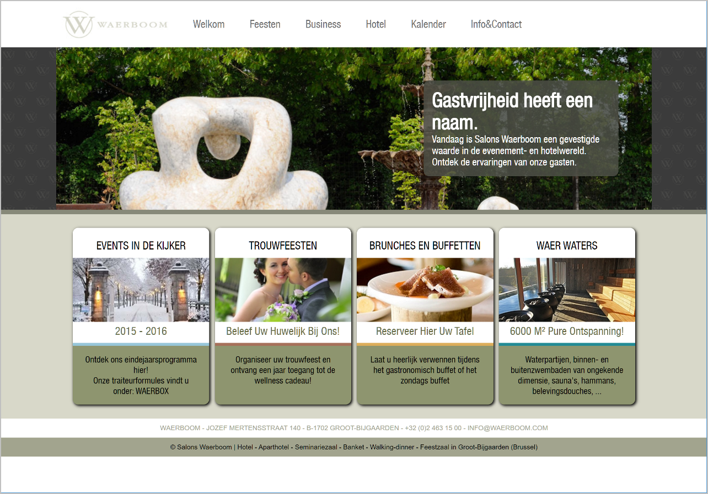

# Oefeningen hoofdstuk 7: Layout Flex

Download of clone deze repository. Hiervoor klik je op de groene knop.

Pak deze zip uit in de map waar je alle leermateriaal van Webapplicaties I plaatst.

Ga nu naar Visual Studio Code en open deze map.

## Oefening 1: NavigationBars
Om een navigatiebalk te maken gebruiken we meestal een bulleted list, waarbij we de list items horizontaal afbeelden. 

```html
      <nav>
          <ul>
              <li><a href="#">Page 1</a></li>
              <li><a href="#">Page 2</a></li>
              <li><a href="#">Page 3 is longer</a></li>
              <li><a href="#">Page 4</a></li>
          </ul>
      </nav>
```

De list items zullen echter meestal niet de volledige breedte van de navigatiebalk innemen. Met flexbox beschik je over veel mogelijkheden om de overgebleven witruimte te verdelen.

Open de map **NavigationBars** met de startbestanden in Visual Studio Code en pas het CSS-bestand aan zodat je de onderstaande webpagina bekomt.

Je start best met het verwijderen van de bullets en alle padding en margin op de ul-elementen.


 
## Oefening 2: Cards

Open de map **Cards** met de startbestanden in Visual Studio Code.

Plaats de drie cards naast elkaar met behulp van flexbox. Je moet onderstaande schermafbeelding bekomen:


Denk na over hoe je de Card footers naar beneden kan duwen gebruikmakend van flexbox.
Je moet het volgende resultaat bekomen:


 
## Oefening 3: Salons Waerboom

De bedoeling van deze oefening is de webpagina **Salons Waerboom** verder afwerken en hierbij zoveel mogelijk gebruikmaken van flexbox.
1. Open de map **SalonsWaerboom** met de startbestanden in Visual Studio Code. In principe hoef je niets meer te wijzigen aan de HTML-code. Je moet enkel de CSS-code aanpassen.
2. Zorg ervoor dat de breedte van de `.content-wrapper` altijd 1050 pixels is en dat deze horizontaal gecentreerd is binnen de webpagina. Zie onderstaande schermafbeelding.
3. Header:
   - Gebruik flexbox om het logo en de navigatiebalk naast elkaar te plaatsen en gebruik als verdeling 20% (logo) en 60% (navigatie). Centreer de items ook verticaal.
   - Kenmerken van de navigatiebalk
     - Gebruik als tekstkleur voor de links #757575 
     - Plaats de links naast elkaar door middel van flexbox. Zie vorige oefening.
     - Als over een navigatielink gehoverd wordt, moet de kleur veranderen naar #1a7780.
4. De section met de vier artikels:
   - Gebruik flexbox om de vier artikels naast elkaar te plaatsen en horizontaal   te centreren binnen de `.content-wrapper`.
   - De gekleurde lijn per artikel is de onderrand (5px) van het header-element.
     Gebruik hier advanced selectors.
     De gebruikte kleuren zijn:
     - artikel 1: kleur = #97c6d9 
     - artikel 2: kleur = #a6715a
     - artikel 3: kleur = #dcad5b
     - artikel 4: kleur = #238b95
5. Footer:
   - De teksten in de footer zijn horizontaal gecentreerd.
   - De eerste paragraaf in de footer heeft een witte achtergrond en de tekstkleur is #a2a48e.
   - Voorzie 10 pixels witruimte rond de teksten.



## Oefening 4: Yoko

In deze oefening moet je een aantal layouts uit de vorige hoofdstukken hermaken met flexbox.

De startbestanden van deze oefening zijn de oplossingen van Yoko uit het vorige hoofdstuk. Enkel het h1-element is verplaatst naar het nav-element. 

1. Gebruik flexbox in plaats van float om het h1-element en het a-element naast elkaar te plaatsen. Om dit mogelijk te maken is, zoals reeds hierboven vermeld, het h1-element in de HTML-code verplaatst naar het nav-element.
2. Gebruik flexbox i.p.v. inline-block om de navigatielinks naast elkaar te plaatsen.
3. Gebruik flexbox om 'figure' en '.description' naast elkaar te plaatsen. 


 

